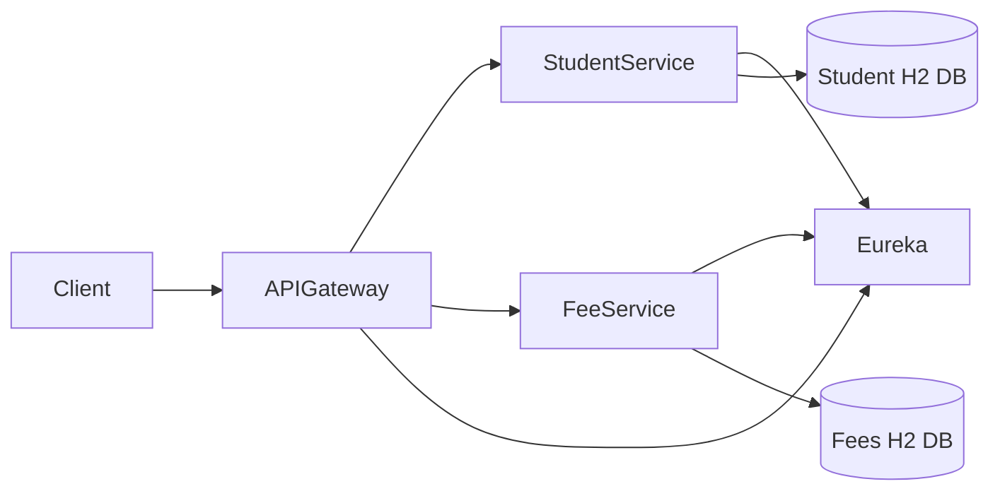
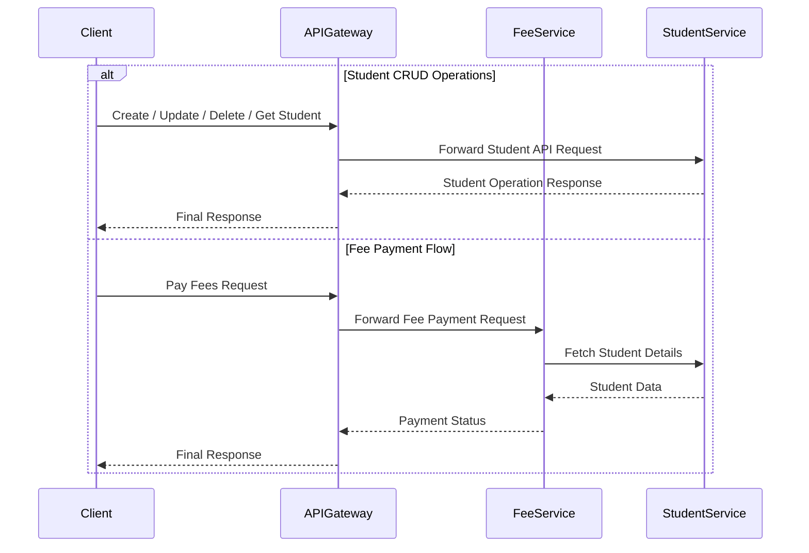

# RAK Bank Microservices Assessment

This project demonstrates a **microservices-based architecture** built using **Spring Boot**, **Spring Cloud**, **Eureka Service Discovery**, and **H2 in-memory databases**.

The system simulates a simplified **student fee management workflow** where client requests are routed through an **API Gateway**, which communicates with downstream services.

The system also implements **Correlation ID based distributed logging** to trace requests across multiple microservices.

---

# Architecture Overview

The system follows a **microservices architecture with an API Gateway and service discovery**.



---

# Microservices

| Service | Port | Description |
|------|------|------|
| Eureka Server | 8761 | Service registry for microservices |
| API Gateway | 8083 | Entry point for all client requests |
| Student Service | 8081 | Manages student data |
| Fees Collection Service | 8082 | Handles fee payments |

---

# Request Flow

All client requests go through the **API Gateway**, which routes them to the appropriate microservice.



---

# Distributed Logging with Correlation ID

The system implements **Correlation ID based logging** to track requests across services.

Each request generates or propagates a **Correlation ID**, which is included in logs across all microservices involved in the request.

Example:

```
Client Request
Correlation-ID: 8f12a9c4

API-Gateway
[Correlation-ID: 8f12a9c4] Incoming request /api/fees/pay

Fees-Service
[Correlation-ID: 8f12a9c4] Processing fee payment

Student-Service
[Correlation-ID: 8f12a9c4] Fetching student details
```

This helps with:

- Distributed tracing
- Debugging microservice requests
- Observability

---

# Database Initialization

The repository contains **`data.sql` files** that automatically initialize the **H2 in-memory database** when the **Student Service starts**.

When the Student Service starts:

- The H2 database is automatically populated
- **20 sample student records are inserted**

This helps in testing the APIs without manually inserting data.

---

# Student Service Features

The **Student Service** provides complete **CRUD operations** for managing students.

Supported operations:

| Operation | Description |
|------|------|
| Create | Add a new student |
| Read | Fetch student details |
| Update | Modify existing student information |
| Delete | Remove a student record |

---

# Prerequisites

Ensure the following tools are installed:

- **Java 25+**
- **Maven 3.9+**
- **Git**
- **Postman**

---

# Setup Instructions

## Clone the Repository

```bash
git clone <repository-url>
cd <project-directory>
```

---

## Start All Services

Run the startup script:

```bash
./start-dev.sh
```

Recommended environments:

- Linux
- Mac
- Windows (Git Bash)

This script will:

- Install Maven dependencies
- Build all services
- Start Eureka Server
- Start API Gateway
- Start all microservices

Please wait a few minutes for all services to initialize.

---

# Service Dashboards

## Eureka Server

```
http://localhost:8761
```

All microservices including **API Gateway** will be registered here.

---

# H2 Database Consoles

## Student Service Database

```
URL: http://localhost:8081/h2-console
DB URL: jdbc:h2:mem:mydb
Username: sa
Password: password
```

# API Documentation (Swagger)

Interactive API documentation is available using **Swagger UI** for both microservices.

Swagger allows developers to:

- Explore available APIs
- View request/response models
- Execute API calls directly from the browser
- Understand API contracts easily

---

## Student Service API

Swagger UI:

```
http://localhost:8081/swagger-ui/index.html
```

OpenAPI Specification:

```
http://localhost:8081/v3/api-docs
```

The Student Service provides **CRUD operations** for managing student records.

Supported operations include:

- Create Student
- Get All Students
- Get Student By ID
- Update Student
- Delete Student

The H2 database is automatically initialized with **20 student records** when the service starts using the `data.sql` script.

---

## Fees Collection Service API

Swagger UI:

```
http://localhost:8082/swagger-ui/index.html
```

OpenAPI Specification:

```
http://localhost:8082/v3/api-docs
```

The Fees Collection Service handles **student fee payment operations** and communicates with the **Student Service** to retrieve student details before processing payments.

---

## How to Use Swagger

1. Open the Swagger UI link for the service.
2. Expand the API endpoint you want to test.
3. Click **Try it out**.
4. Enter the required parameters.
5. Click **Execute** to call the API.

Swagger will display:

- Request details
- Response body
- HTTP status codes

---

---

## Fees Collection Service Database

```
URL: http://localhost:8082/h2-console
DB URL: jdbc:h2:mem:feesdb
Username: sa
Password: password
```


---

# API Testing

1. Open **Postman**
2. Import the provided collection

```
postman-collection.json
```

3. Execute APIs through the **API Gateway (port 8083)**.

---

# Technology Stack

| Technology | Purpose |
|------|------|
| Spring Boot | Microservice framework |
| Spring Cloud | Distributed system tools |
| Eureka | Service discovery |
| Spring Cloud Gateway | API Gateway |
| H2 Database | In-memory database |
| Maven | Build tool |
| Lombok | Boilerplate reduction |

---

# Project Structure

```
project-root
│
├── eureka-server
├── api-gateway
├── student-service
├── fees-collection-service
├── start-dev.sh
└── postman-collection.json
```

---

# Notes

- All databases are **in-memory**, meaning data resets when services restart.
- The **Student Service database is automatically populated with 20 records** using `data.sql`.
- Ensure the following ports are available:

```
8761  Eureka Server
8081  Student Service
8082  Fees Collection Service
8083  API Gateway
```